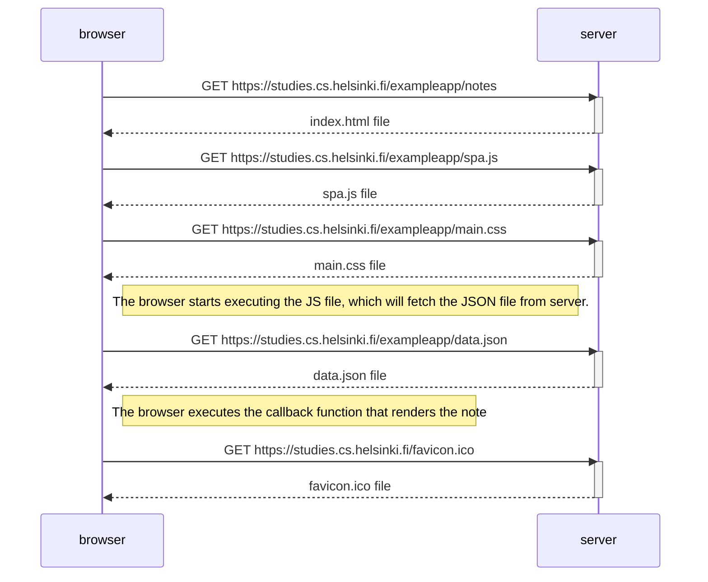

```mermaid
sequenceDiagram
participant browser
participant server
	
	browser->>server: GET https://studies.cs.helsinki.fi/exampleapp/notes
	activate server
	server-->>browser: index.html file
	deactivate server
	
	browser->>server: GET https://studies.cs.helsinki.fi/exampleapp/spa.js
	activate server
	server-->>browser: spa.js file
	deactivate server
	
	browser->>server: GET https://studies.cs.helsinki.fi/exampleapp/main.css
	activate server
	server-->>browser: main.css file
	deactivate server
	
	Note right of browser: The browser starts executing the JS file, which will fetch the JSON file from server.
	
	browser->>server: GET https://studies.cs.helsinki.fi/exampleapp/data.json
	activate server
	server-->>browser: data.json file
	deactivate server
	
	Note right of browser: The browser executes the callback function that renders the note
	
	browser->>server: GET https://studies.cs.helsinki.fi/favicon.ico
	activate server
	server-->>browser: favicon.ico file
	deactivate server

```
