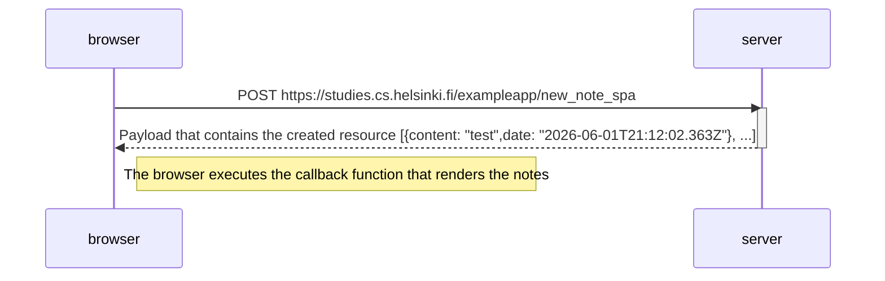

```mermaid
sequenceDiagram
participant browser
participant server

    browser->>server: POST https://studies.cs.helsinki.fi/exampleapp/new_note_spa
    activate server
    server-->>browser: Payload that contains the created resource [{content: "test",date: "2026-06-01T21:12:02.363Z"}, ...]
    deactivate server

    Note right of browser: The browser executes the callback function that renders the notes
```
